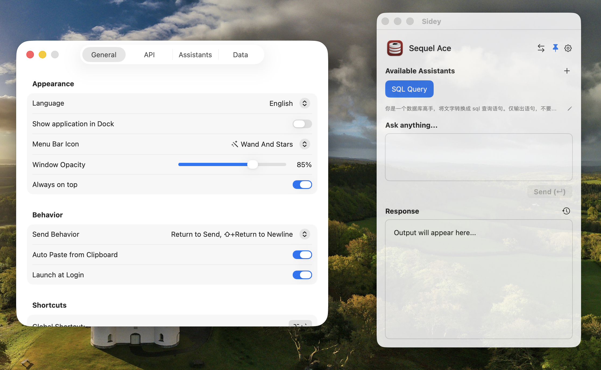

# Sidey - Your Intelligent macOS Sidekick

<p align="center">
  
</p>

[English](#english) | [简体中文](#简体中文)

---

<a name="english"></a>
## English

**Sidey** is a lightweight, context-aware AI assistant designed specifically for macOS. It stays by your side, understanding which application you are currently using and providing tailored AI assistance through customizable prompts.

### ✨ Key Features

- **Context Awareness**: Automatically detects the frontmost application and suggests relevant prompts.
- **Customizable Prompts**: Create and manage different AI personas or tasks for specific apps (e.g., "Code Review" for Xcode, "Summarize" for Safari).
- **Global Hotkey**: Summon your assistant instantly from anywhere with a customizable keyboard shortcut.
- **Smart Clipboard**: Automatically paste clipboard content when activated, with a one-click "Undo" to restore your previous input.
- **Markdown Support**: Beautifully rendered AI responses with full Markdown support.
- **iCloud & File Sync**: Keep your prompts and settings synced across devices via iCloud or a custom sync folder (Dropbox, iCloud Drive, etc.).
- **App Switcher**: Quickly switch back to your recently used applications or explore running apps directly from the assistant.



### 🚀 Getting Started

#### Prerequisites
- macOS 13.0 or later.
- An OpenAI-compatible API Key.

#### Installation
1. Download the latest release or build from source using the provided `build_app.sh` script.
2. Move **Sidey.app** to your `/Applications` folder.
3. Launch the app and go to **Settings > API** to enter your API Key and Base URL.

#### Building from Source
```bash
git clone https://github.com/chentao1006/sidey.git
cd sidey
./build_app.sh
```

---

<a name="简体中文"></a>
## 简体中文

**Sidey** 是一款专为 macOS 设计的轻量级、场景感知 AI 助手。它能实时理解你正在使用的应用程序，并根据当前环境提供定制化的 AI 建议。

### ✨ 核心功能

- **场景感知**：自动检测当前前台应用，并推荐与之关联的助手指令。
- **自定义助手**：为特定应用创建不同的 AI 角色或任务（例如：为 Xcode 设置“代码审查”，为 Safari 设置“内容总结”）。
- **全局快捷键**：通过可自定义的快捷键，随时随地唤醒你的 AI 助手。
- **智能剪贴板**：唤醒时自动贴入剪贴板内容，并提供“一键撤销”功能以找回原有输入。
- **Markdown 支持**：完美的 Markdown 渲染，让 AI 响应清晰易读。
- **多端同步**：支持通过 iCloud 或自定义同步目录（如 Dropbox、iCloud Drive 文件夹）同步助手指令和设置。
- **应用切换**：在助手中快速切换回最近使用的应用或查看正在运行的程序。


### 🚀 快速上手

#### 系统要求
- macOS 13.0 或更高版本。
- OpenAI 或其兼容服务的 API Key。

#### 安装步骤
1. 下载最新发行版，或使用内置的 `build_app.sh` 脚本进行编译。
2. 将 **Sidey.app** 移动到 `/Applications`（应用程序）文件夹。
3. 启动应用，前往 **设置 > API** 输入你的 API 密钥和接口地址 (Base URL)。

#### 源码编译
```bash
git clone https://github.com/chentao1006/sidey.git
cd sidey
./build_app.sh
```

---

### 📄 License

This project is licensed under the MIT License - see the [LICENSE](LICENSE) file for details.

---

<p align="center">
Made with ❤️ for macOS power users.
</p>
