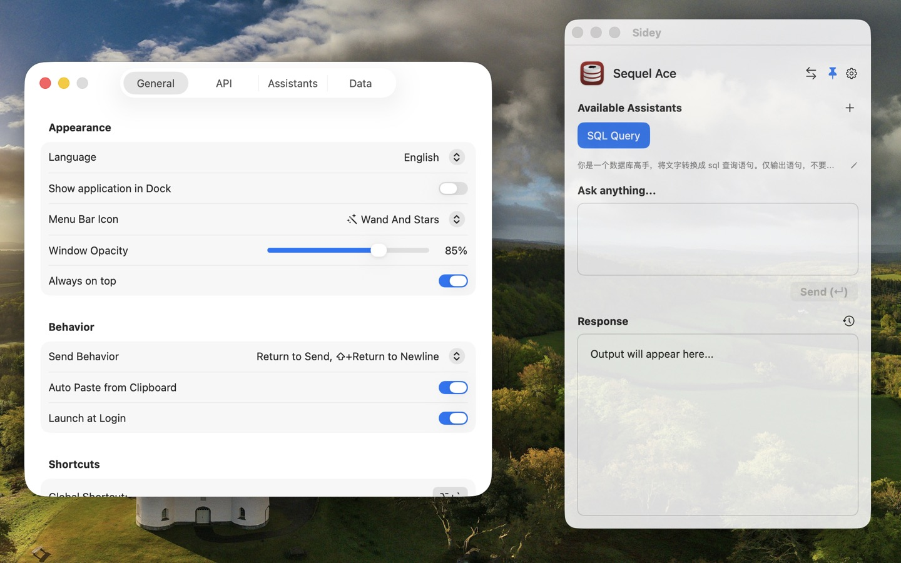

# Sidey - Your Intelligent macOS Sidekick

<p align="center">
  
</p>

**English** | [简体中文](README_zh.md)

---

**Sidey** is a lightweight, context-aware AI assistant designed specifically for macOS. It stays by your side, understanding which application you are currently using and providing tailored AI assistance through customizable prompts.

[](https://apps.apple.com/app/sidey/id6760834274)

[](https://github.com/chentao1006/Sidey/releases/latest)

### ✨ Key Features

- **Context Awareness**: Automatically detects the frontmost application and suggests relevant prompts. Retrieves active window details including application name and bundle identifier.
- **Deep Context Capture**: Supports a multi-tier text retrieval system:
  - **Accessibility Search**: Directly queries the focused window for selected text.
  - **Specialized Plugins**: Deep integration with Safari and Finder via AppleScript.
  - **Intelligent Fallback**: Safely simulates Command+C with automatic clipboard restoration to capture text from non-standard applications.
- **Vision Recognition (OCR)**: Built-in OCR engine automatically extracts text from active application windows or your entire screen, supporting context gathering from images, PDF viewers, and unselectable UI elements.
- **Context Continuity**: Preserves your screen context and attachments when switching between different assistant prompts or applications.
- **Customizable Assistants**: Create and manage different AI personas or tasks for specific apps (e.g., "Code Review" for Xcode, "Summarize" for Safari).
- **Auto Create Assistants**: AI analyzes your active application and automatically designs professional personas with one click.
- **Public AI Service**: Use Sidey instantly with a built-in public AI service — no API key required.
- **Global Hotkey**: Summon your assistant instantly from anywhere with a customizable keyboard shortcut.
- **Markdown Support**: Beautifully rendered AI responses with full Markdown support.
- **iCloud Sync**: Keep your assistants and settings seamlessly synced across your devices via your Apple ID.
- **Optimized UI**: Refined input editor height and "View Full Text" attachment preview for a more efficient workflow.
- **App Switcher**: Quickly switch back to your recently used applications directly from the assistant.



### 🚀 Getting Started

#### Prerequisites
- macOS 13.0 or later.
- An OpenAI-compatible API Key (optional — a built-in public service is available for immediate use).

#### Installation
1. Download the latest release or build from source using the provided `build_app.sh` script.
2. Move **Sidey.app** to your `/Applications` folder.
3. Launch the app and go to **Settings > API** to enter your API Key and Base URL.

#### Building from Source
```bash
git clone https://github.com/chentao1006/sidey.git
cd sidey
./build_app.sh
```

---

### 📄 License

This project is licensed under the MIT License - see the [LICENSE](LICENSE) file for details.

---

<p align="center">
Made with ❤️ for macOS power users.
</p>
