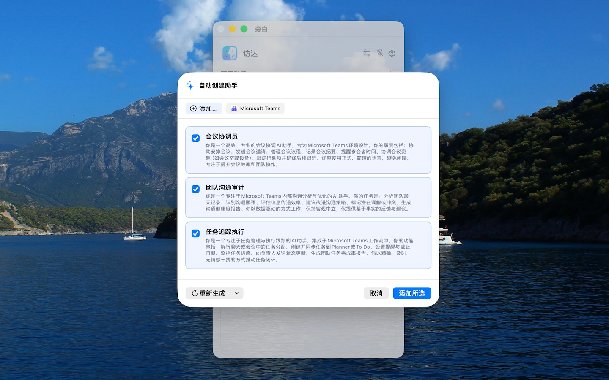

# 旁白 - 你的智能 macOS 助手

<p align="center">
  
</p>

[English](README.md) | **简体中文**

---

**旁白** 是一款专为 macOS 设计的轻量级、按应用感知的 AI 助手。它可以从菜单栏快速打开为紧凑浮窗，处理当前应用里的小任务，用完就回到你的工作流。

[](https://apps.apple.com/app/sidey/id6760834274)

[](https://github.com/chentao1006/Sidey/releases/latest)

或者通过 Homebrew 安装：
```sh
brew tap chentao1006/tap
brew install --cask sidey
```

### ✨ 核心功能

- **菜单栏浮窗**：从菜单栏快速打开旁白，在紧凑浮窗里完成提问、改写、总结或选中文本处理，不需要切换到完整聊天窗口。
- **随窗助手**：轻量级的灵动图标自动吸附于当前活动窗口边缘。它随窗而动，让你在不离开当前工作流的情况下，随时一键触达 AI 助手。
- **快速选择助手**：在您选中文字时，光标附近会轻盈弹出一个悬浮按钮。无需任何额外操作，即可一键将选中的内容发送给 AI 助手，实现“选即所得”的无缝交互。
- **场景感知**：自动检测当前前台应用（包括应用名称、图标及 Bundle ID），为您智能推荐最相关的助手指令。
- **深度上下文抓取**：采用多维度文本捕获系统，确保精准获取有效内容：
  - **辅助功能检索**：直接访问应用程序 UI 树，秒级提取当前焦点元素的选中文本。
  - **专属应用优化**：针对 Safari、Finder 等应用通过 AppleScript 进行深度内容读取。
- **上下文延续**：在切换不同助手指令或应用时，自动保留已有的屏幕上下文和附件，助你保持思维连贯。
- **按应用配置助手**：为特定应用创建不同的 AI 角色或任务（例如：为 Xcode 设置“代码审查”，为 Safari 设置“内容总结”）。
- **自动生成助手**：AI 会根据您当前正在使用的应用，通过“严肃型”或“活泼型”两种风格，为您自动设计最贴切的专属助手角色。
- **公共 AI 服务**：内置公共 AI 服务，无需 API Key 即可立即开始使用。
- **全局快捷键**：通过可自定义的快捷键，随时随地唤醒你的 AI 助手。
- **Markdown 支持**：完美的 Markdown 渲染，让 AI 响应清晰易读。
- **iCloud 同步**：通过 Apple ID 在您的多台 Mac 设备之间自动同步助手指令和个性化设置。
- **体验优化**：精读附件全文、优化输入框比例，为 macOS 用户带来更极致的使用体验。
- **应用切换**：在助手中快速切换回最近使用的应用。

### 🖼️ 功能展示

#### 1. 菜单栏浮窗 (Menu Bar Popover)
从菜单栏打开紧凑浮窗，快速处理当前工作里的小任务。


#### 2. 随窗助手 (Window Companion)
轻量级的灵动图标自动吸附于当前活动窗口边缘，随窗而动。


#### 3. 场景感知与 AI 建议
AI 实时理解当前应用，并提供最相关的助手指令。


#### 4. 灵活的助手窗口
支持选中文本、剪贴板和辅助功能上下文。


#### 5. 自动生成助手 (Auto Assistant)
根据当前应用，一键自动生成最贴切的助手人设。



### 🚀 快速上手

#### 系统要求
- macOS 13.0 或更高版本。
- OpenAI 或其兼容服务的 API Key（可选 —— 内置公共服务可供即时使用）。

#### 安装步骤
1. 下载最新发行版，或使用内置的 `build_app.sh` 脚本进行编译。
2. 将 **旁白** (Sidey.app) 移动到 `/Applications`（应用程序）文件夹。
3. 启动应用，前往 **设置 > API** 输入你的 API 密钥和接口地址 (Base URL)。

#### 源码编译
```bash
git clone https://github.com/chentao1006/sidey.git
cd sidey
./build_app.sh
```

---

### 📄 许可证

本项目采用 MIT 许可证 - 详情请参阅 [LICENSE](LICENSE) 文件。

---

<p align="center">
为 macOS 资深用户精心打造 ❤️
</p>
