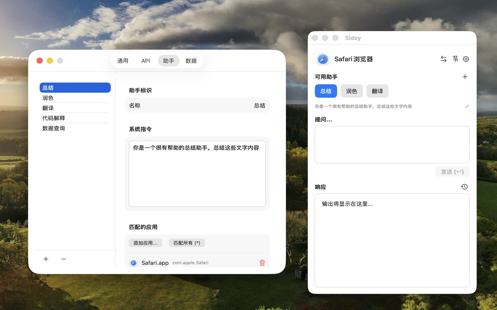

# 不必再切出当前窗口：我为什么推荐这款叫「旁白」的 macOS AI 助手

如果你也经常在写作、编程、阅读和整理资料之间来回切换，大概已经习惯了这样的动作：选中一段文字，切到浏览器里的 AI 对话页面，粘贴，输入问题，等待回答，再切回原来的应用。

单次操作并不算麻烦，但一天重复几十次之后，AI 就从“助手”变成了另一个需要维护的工作窗口。

最近我在用一款 macOS 应用 Sidey，它的中文名是「旁白」。它没有把自己做成一个需要一直打开的大型聊天窗口，而是把 AI 放在菜单栏、当前窗口边缘和选中文字附近。用完即走，回答也尽量回到原来的工作流里。

这正是我愿意推荐它的原因：旁白解决的不是“再提供一个聊天机器人”，而是“如何让 AI 更靠近正在发生的工作”。

## 菜单栏里的一块小浮窗

旁白启动后主要待在菜单栏。点击图标，或者使用自定义的全局快捷键，就能呼出一个紧凑的浮窗。

它的使用方式很像一个随时可调用的工具箱：需要翻译时问一句，需要润色时贴入一段文字，需要总结时把资料交给它。回答完成后关闭浮窗，主任务仍然留在原来的应用中，不需要在 Dock 里管理一个常驻的聊天窗口。

这种设计尤其适合那些“问题很小，但出现得很频繁”的场景：给邮件换一种语气、解释一段报错、把会议记录压缩成几条要点，或者帮我把刚写好的句子改得更自然。每次只处理一个小任务，反而比把所有内容都集中到一个长期对话里更清楚。

## 随窗助手：AI 可以待在窗口旁边

除了菜单栏浮窗，旁白还提供一个我觉得很有意思的入口：随窗助手。

它是一个轻量的灵动图标，会吸附在当前活动窗口的边缘，并随着窗口移动或调整大小。需要帮助时点击它，就能打开助手；不需要时，它不会占据大块屏幕，也不会挡住编辑区域。

它的价值并不在于“多一个按钮”，而在于降低了调用 AI 的心理和操作成本。以前我要先想到“打开 AI”，现在只需要看到窗口旁边的小图标，就可以顺手问一句。对于需要频繁参考资料、处理文本的工作，这种贴近当前窗口的感觉很自然。

## 随光标浮窗：选中文字，就能直接处理

旁白还支持随光标出现的临时助手浮窗。选中文字或按下快捷键后，浮窗就会在光标旁打开，并带上当前选中的内容；可以直接输入问题，不必复制、切换应用、粘贴，再补充上下文。

比如在 Safari 里读一篇英文文章，可以选中段落后让它翻译或解释；在 Xcode 里选中一段代码，可以让它说明逻辑、查找潜在问题；在邮件或文档里选中几句话，则可以直接要求它润色、改写或调整语气。

当然，这类能力需要 macOS 的辅助功能权限。首次使用时需要在系统设置中允许旁白访问相关内容。对一款需要理解当前窗口的工具来说，这是必要的权限，但建议只在自己信任的设备上开启，并按照自己的隐私需求选择使用范围。

## 它知道我正在使用什么应用

旁白和普通聊天窗口的另一个区别，是它会感知当前的前台应用，并据此匹配助手。

你可以为不同应用配置不同的助手。例如：

- 在 Xcode 中使用“代码审查”或“解释报错”；
- 在 Safari 中使用“网页总结”或“翻译选段”；
- 在 Finder 中使用文件和路径相关的整理助手；
- 在其他应用中配置自己的写作、改写或头脑风暴角色。

这意味着我不必每次都重新描述“你现在要扮演什么角色”。当我从浏览器切换到编辑器，旁白也可以跟着切换到更合适的提示词。

如果不想从零开始配置，旁白还支持根据当前应用自动生成助手。它会给出偏严肃或偏活泼的角色建议，再由我选择和修改。这个功能不一定能一次生成完美提示词，但很适合快速搭出一个可用的起点。

## 剪贴板和上下文，让提问少写几句

很多时候，我们并不是没有问题，而是不想重复搬运上下文。旁白支持读取选中文本，也可以在唤醒时发现新复制的内容，并将其自动填入输入框。

例如我刚从网页复制了一段资料，下一步通常是问“这段内容的重点是什么”或“把它改成适合发给同事的说明”。旁白可以直接接住这段剪贴板内容，我只需要补充任务，而不必再手动粘贴一次。

它还支持在切换助手或应用时保留已有的屏幕上下文和附件。对于连续处理一份资料来说，这比每打开一个新窗口就重新开始更连贯。

## 不绑定单一模型，配置方式比较开放

旁白内置了公共 AI 服务，安装后可以直接体验，不需要一开始就准备 API Key。不过公共服务有频率和每日总量限制，如果使用频率较高，还是建议在设置中填入自己的 API Key。

它支持 OpenAI 以及兼容 OpenAI 接口的服务，可以填写自定义 Base URL 和模型。对已经在使用不同模型服务的人来说，不必为了一个桌面入口再换一套工作方式。

这也是我比较看重的一点：旁白的重点是“调用入口和上下文组织”，而不是强行把用户锁定在某个模型上。你可以把它当成一个轻量的本地工作层，再接入自己熟悉的服务。

## 适合哪些人？

我觉得旁白最适合以下几类 macOS 用户：

- 经常在编辑器、浏览器和文档应用之间切换的人；
- 需要频繁翻译、总结、润色或解释文本的人；
- 希望使用 AI，但不想让聊天窗口占据桌面的人；
- 已经有 API 或模型服务，希望在系统级入口调用它的人；
- 喜欢用快捷键和菜单栏工具提高效率的人。

如果你的需求是长时间进行复杂对话、管理大量项目资料，专门的 AI 客户端可能更合适。旁白的定位更像“工作流里的即时协作者”：它擅长处理眼前这段内容，而不是替代完整的知识库或项目管理工具。

## 我的使用建议

第一次安装后，我建议先按下面的顺序体验：

1. 在系统设置中授予旁白所需的辅助功能权限；
2. 设置一个自己顺手的全局快捷键；
3. 打开剪贴板自动填充，试着处理一段刚复制的文本；
4. 为最常用的应用配置一个专属助手；
5. 再开启随窗助手，观察它是否适合自己的桌面习惯。

旁白支持 macOS 13 及更高版本，可以通过 Mac App Store、GitHub 安装包或 Homebrew 安装。设置和助手指令还可以通过 iCloud 在多台 Mac 之间同步，也支持备份与恢复。

## 写在最后

AI 工具越来越多，但真正能留下来的，往往不是功能列表最长的那一个，而是最容易在需要时被调用的那个。

旁白给我的感觉就是这样：它不抢走当前窗口的注意力，也不要求我为每个小问题切换到一个专门的聊天应用。它把菜单栏、快捷键、选中文字、剪贴板和当前应用连接起来，让 AI 变成工作流旁边的一层轻薄工具。

如果你使用 Mac 的时间很长，又经常需要对眼前的文字、代码和资料做一点翻译、总结、改写或解释，旁白值得试试看。

**官网：** https://sidey.ct106.cc/  
**应用名称：** Sidey（中文名：旁白）  
**系统要求：** macOS 13 及以上  
**获取方式：** [Mac App Store](https://apps.apple.com/app/sidey/id6760834274) ｜ [GitHub](https://github.com/chentao1006/Sidey) ｜ Homebrew：`brew install --cask sidey`
